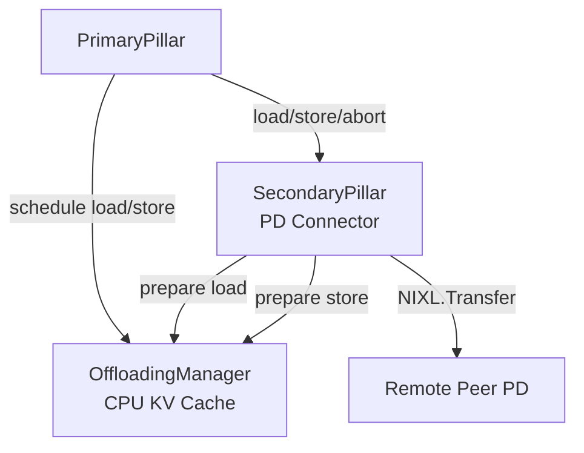
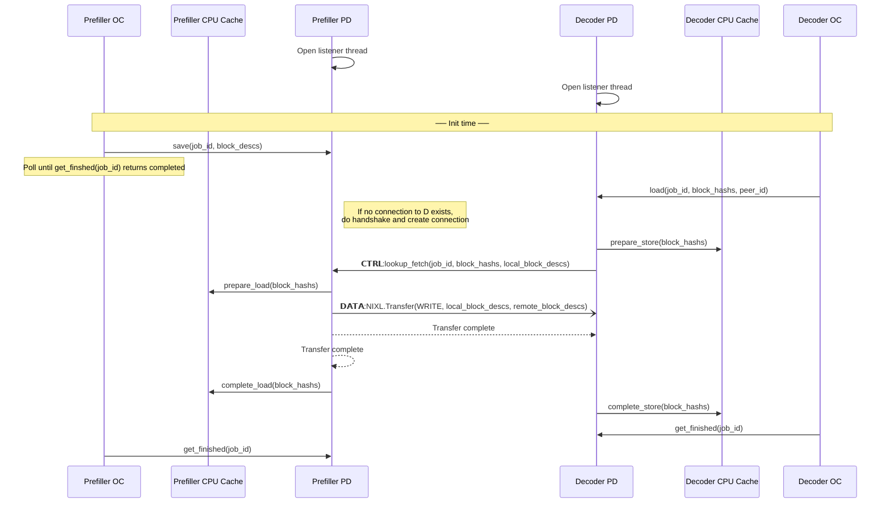

# PD Connector Design Document

## Abstract

In this design PD disaggregation is based on the vLLM CPU KV cache which is per vLLM instance and it is in canonical layout (single TP unified block size). The PD Connector is a secondary pillar that is registered as such. The OffloadingManager, which controls the CPU KV cache, exposes an API to the secondary pillar to allow load, store and abort operations.

## Assumptions

- Decoder can be known or unknown to Prefiller when a request is submitted to the Prefiller (Deffered decode)
- A request can be submitted to the Decoder before Prefiller has completed the request
- Translating canonical layout to per GPU worker layout is done in the worker context (Secondary pillars are agnostic to that)
- A store operation to the CPU KV cache can fail only by:
  - Allocation failure
  - Prefiller crash

## Requirements

- Each Prefill node can service pull requests from any other node in the cluster
- Crash of Prefiller or Decoder should be handled gracefully without any resource leaks
- Support general P2P sharing pro-active and reactive
- Security? Does Prefiller or Decoder should accept transfer requests without any authentication?
- Different block size across nodes in the cluster?
- Performance of TTFT and Tok/Sec should be similar to the existing NixlConnector

## HLD

### Architecture

#### Components

- **PrimaryPillar** — The main component that drives the KV cache lifecycle. It interacts with the OffloadingManager to offload GPU memory to CPU and triggers secondary pillars accordingly.

- **OffloadingManager** — Runs in the scheduler and tracks which KV blocks are offloaded and their address. Exposes primitives to secondary pillars for load and store operations.

- **SecondaryPillar** — A pluggable component registered with the OffloadingManager that implements the actual KV cache transfer between nodes. The PD Connector is implemented as a secondary pillar, handling load and store between peers.

#### Component Diagram



### Design Decisions

- P block IDs – how do we pass request's allocated blocks on Prefiller to Decoder.
  - **Option 1** - Add allocated blocks to request header on Prefiller.
    - When do we know for sure that blocks have been saved already
  - **Option 2** - Control message that will prepare the data operation and then trigger one-sided transfer.
- Allow streaming of saved KV blocks on the prefiller side to the Decoder.
### API
#### OffloadingManager
- `lookup()` — find the length of the maximal series of blocks, starting from the first one, that are all offloaded.
- `prepare_load()` — prepare given blocks to be read, protecting them from eviction. Returns a `LoadStoreSpec` for the worker.
- `touch()` — mark blocks as recently used for LRU tracking.
- `complete_load()` — mark previously prepared blocks as done loading, re-allowing eviction.
- `prepare_store()` — prepare given blocks to be written. Returns a `PrepareStoreOutput` with store spec and evicted blocks.
- `complete_store()` — mark a previous store as completed, making blocks loadable.

#### Secondary Pillar
- `register_secondary_pilar()`
- `load(job_id, block_hashs, peer_id)` — Decoder initiates a load from Prefiller
- `save(job_id, block_descs)` — Prefiller saves blocks
- `get_finished()` — Async notification of load/save operation completion
- `abort(job_id)` — Abort an in-progress operation

### Flow

#### Sequence Diagram


### Error Handling
#### Allocation Failure on Prefiller Side (valid only when a request is sent to the Decoder before the Prefiller completes it)
Two options are available:
- **Option 1** — The orchestration layer sends an abort to the Decoder.
- **Option 2** — On the Prefiller side, the secondary pillar is notified about the request abort and fails the `lookup_fetch` call accordingly.
#### vLLM Crash
- A lost control connection between the Prefiller and the Decoder should trigger an abort of all ongoing requests.
#### Submit lookup_fetch() before a request is submitted to the Prefiller
- OffloadingManager.prepare_load() should return the following status:
  1. SUCCESS - When KV blocks exist (KV block descs will be returned)
  2. NOT_EXIST - There is no ongoing save operation for these blocks
  3. PENDING - There is uncompleted save operation for these blocks

## Implementation

### Step 1: SecondaryPillars

Introduce a `SecondaryPillar` base class and a `SecondaryPillars` registry component. `PrimaryPillar` depends on `SecondaryPillars` to dispatch operations. Individual `SecondaryPillar` implementations register themselves into `SecondaryPillars` without any knowledge of `PrimaryPillar`.

```
PrimaryPillar --> SecondaryPillars --> [SecondaryPillar, SecondaryPillar, ...]
```

#### Tasks
- [ ] Define `SecondaryPillar` abstract base class with `load`, `save`, `get_finished`, `abort` methods
- [ ] Implement `SecondaryPillars` registry with `register(pillar: SecondaryPillar)` and dispatch methods
- [ ] `PrimaryPillar` holds a reference to `SecondaryPillars` and calls it on `load`/`save`/`abort`
- [ ] `SecondaryPillars` iterates registered pillars and calls each in sequence
- [ ] Add unit tests for registration and sequential dispatch

#### Tests

Tests are located in `tests/test_secondary_pillars.py`.

To run:
```bash
cd /home/lirans/my-utils/pd-connector
python3 -m pytest tests/test_secondary_pillars.py -v
```

### Step 2: PDConnector as a SecondaryPillar

Implement `PDConnector` as a concrete `SecondaryPillar`. It handles the actual KV cache transfer between Prefiller and Decoder nodes using NIXL.

On the **Prefiller side**, `save()` stores KV block descriptors and waits for incoming `lookup_fetch` requests from the Decoder.
On the **Decoder side**, `load()` connects to the Prefiller peer, sends a `lookup_fetch` control message, and triggers a NIXL transfer to pull the blocks into the local CPU cache.

#### Tasks
- [ ] Implement `PDConnector(SecondaryPillar)` class in `src/pd_connector.py`
- [ ] `save(job_id, block_descs)` — register block descriptors, ready to serve `lookup_fetch`
- [ ] `load(job_id, block_hashes, peer_id)` — connect to peer, send `CTRL:lookup_fetch`, trigger NIXL transfer
- [ ] `get_finished(job_ids)` — poll NIXL transfer status and return completed job ids
- [ ] `abort(job_id)` — cancel pending transfer and release allocated blocks
- [ ] Add unit tests in `tests/test_pd_connector.py`

#### Tests

Tests are located in `tests/test_pd_connector.py`.

To run:
```bash
cd /home/lirans/my-utils/pd-connector
python3 -m pytest tests/test_pd_connector.py -v
```
