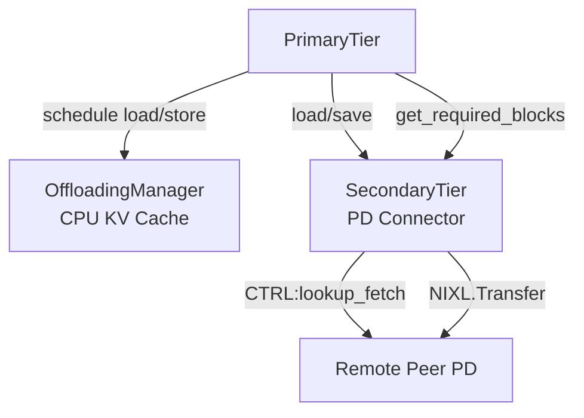
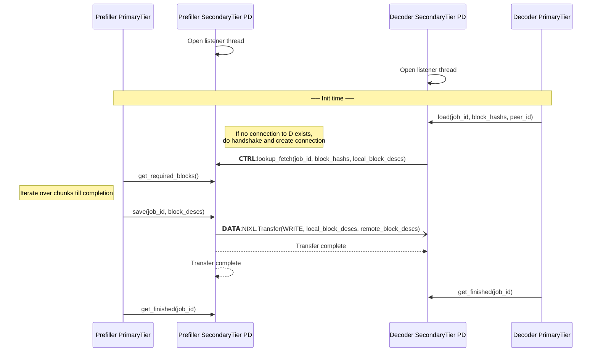

# PD Connector Design Document

## Abstract

In this design PD disaggregation is based on the vLLM CPU KV cache which is per vLLM instance and it is in canonical layout (single TP unified block size). The PD Connector is a secondary tier that is registered as such. Orchestration with the CPU cache is done via the PrimaryTier and it not known to the secondary tiers.

## Assumptions

- Decoder can be known or unknown to Prefiller when a request is submitted to the Prefiller (Deffered decode)
- A request can be submitted to the Decoder without any dependency on submitting the request to the prefiller
- Translating canonical layout to per GPU worker layout is done in the worker context (Secondary tiers are agnostic to that)
- A store operation to the CPU KV cache can fail only by:
  - Allocation failure
  - Prefiller crash

## Requirements

- Each Prefill node can service pull requests from any other node in the cluster
- Crash of Prefiller or Decoder should be handled gracefully without any resource leaks
- Support general P2P sharing pro-active and reactive
- Security?
- Different block size across nodes in the cluster?
- Performance of TTFT and Tok/Sec should be similar to the existing NixlConnector

## HLD

### Architecture

#### Components

- **OffloadingManager (CPU KV Cache)** — Manages the CPU KV cache per vLLM instance in canonical layout.

- **PrimaryTier** — The main component that drives the KV cache lifecycle. It interacts with the OffloadingManager to offload GPU memory to CPU and triggers secondary tiers accordingly.

- **SecondaryTier** — A pluggable component registered with the OffloadingManager that implements the actual KV cache transfer between nodes. The PD Connector is implemented as a secondary tier, handling load and store between peers.

#### Component Diagram



### Design Decisions

- P block IDs – how do we pass request's allocated blocks on Prefiller to Decoder.
  - **Option 1** - Add allocated blocks to request header on Prefiller.
    - When do we know for sure that blocks have been saved already
  - **Option 2** - Control message that will prepare the data operation and then trigger one-sided transfer.
- Allow streaming of saved KV blocks on the prefiller side to the Decoder.
  Implemented by allowing to submit the request to the decoder at once before KV blocks are computed on the Prefiller. This allows the prefiller to send KV blocks once they are in the CPU cache after receiving an allocate_fetch() control command from the decoder.
### API

#### Secondary Tier
- `register_secondary_tier()`
- `load(job_id, block_hashs, peer_id)` — Decoder initiates a load from Prefiller
- `get_required_blocks()` - Polled by the primary tier
- `save(job_id, block_descs)` — Prefiller saves blocks
- `get_finished()` — Async notification of load/save operation completion

### Flow

#### Sequence Diagram


### Error Handling
#### Allocation Failure on Prefiller Side (valid only when a request is sent to the Decoder before the Prefiller completes it)
Temporary solution is based on timeout after lookup_fetch().
An abort request API can be considered that should be passed by the orchestrator layer.
#### vLLM Crash
- A lost control connection between the Prefiller and the Decoder should trigger an abort of all ongoing requests.
#### Submit lookup_fetch() before a request is submitted to the Prefiller
- lookup_fetch() should be constricted by a timeout to catch such a case.

## Implementation

### Step 1: SecondaryTiers

Introduce a `SecondaryTier` base class and a `SecondaryTiers` registry component. `PrimaryTier` depends on `SecondaryTiers` to dispatch operations. Individual `SecondaryTier` implementations register themselves into `SecondaryTiers` without any knowledge of `PrimaryTier`.

```
PrimaryTier --> SecondaryTiers --> [SecondaryTier, SecondaryTier, ...]
```

#### Tasks
- [ ] Define `SecondaryTier` abstract base class with `load`, `save`, `get_finished` methods
- [ ] Implement `SecondaryTiers` registry with `register(tier: SecondaryTier)` and dispatch methods
- [ ] `PrimaryTier` holds a reference to `SecondaryTiers` and calls it on `load`/`save`
- [ ] `SecondaryTiers` iterates registered tiers and calls each in sequence
- [ ] Add unit tests for registration and sequential dispatch

#### Tests

Tests are located in `tests/test_secondary_tiers.py`.

To run:
```bash
cd /home/lirans/my-utils/pd-connector
python3 -m pytest tests/test_secondary_tiers.py -v
```

### Step 2: PDConnector as a SecondaryTier

Implement `PDConnector` as a concrete `SecondaryTier`. It handles the actual KV cache transfer between Prefiller and Decoder nodes using NIXL.

On the **Prefiller side**, the PrimaryTier polls `get_required_blocks()` to determine which blocks the SecondaryTier needs, then calls `save()` to store KV block descriptors. The SecondaryTier waits for incoming `lookup_fetch` requests from the Decoder and initiates the transfer once blocks are available.
On the **Decoder side**, `load()` connects to the Prefiller peer, sends a `lookup_fetch` control message, and triggers a NIXL transfer to save the blocks into the local CPU cache.

#### Tasks
- [ ] Implement `PDConnector(SecondaryTier)` class in `src/pd_connector.py`
- [ ] `save(job_id, block_descs)` — register block descriptors, ready to serve `lookup_fetch`
- [ ] `load(job_id, block_hashes, peer_id)` — connect to peer, send `CTRL:lookup_fetch`, trigger NIXL transfer
- [ ] `get_finished(job_ids)` — poll NIXL transfer status and return completed job ids
- [ ] Add unit tests in `tests/test_pd_connector.py`

#### Tests

Tests are located in `tests/test_pd_connector.py`.

To run:
```bash
cd /home/lirans/my-utils/pd-connector
python3 -m pytest tests/test_pd_connector.py -v
```

### Step 3: ZMQ CtrlTransport

Implement `ZmqCtrlTransport` — a concrete `CtrlTransport` backed by ZMQ. The listener uses a ZMQ `ROUTER` socket so it can accept connections from multiple peers simultaneously. Each peer connects with a `DEALER` socket, and the router identifies peers by their socket identity.

Peer liveness is tracked via a heartbeat mechanism. If a peer stops sending heartbeats within the timeout window, the transport fires a `on_peer_down(peer_id)` callback so that `PDConnector` can abort all in-progress jobs for that peer.

```
Peer A (DEALER) ──┐
Peer B (DEALER) ──┼──► ZmqCtrlTransport (ROUTER) ──► PDConnector
Peer C (DEALER) ──┘         │
                        heartbeat monitor
                        → on_peer_down(peer_id)
```

#### Design decisions
- **Socket types**: `ROUTER` on the listener side, `DEALER` on the connecting side — allows multiplexing N peers on one port.
- **Heartbeat**: each peer sends a periodic `{"type": "heartbeat", "peer_id": "..."}` message. The listener tracks `last_seen[peer_id]` and fires `on_peer_down` if a peer exceeds `heartbeat_timeout_s`.
- **Message format**: MessagePack (msgspec) — consistent with the existing NIXL handshake wire format.
- **Graceful disconnect**: a `{"type": "disconnect", "peer_id": "..."}` message triggers immediate `on_peer_down` without waiting for timeout.

#### Keep-Alive Mechanism

Liveness is implemented using **ZMQ's built-in ZMTP heartbeat** — no application-level ping thread is needed. Both the ROUTER and each DEALER socket have the following socket options set at creation time:

| Option | Default | Description |
|---|---|---|
| `HEARTBEAT_IVL` | 2000 ms | How often ZMQ sends a PING to the peer |
| `HEARTBEAT_TIMEOUT` | 10000 ms | How long ZMQ waits for a PONG before closing the connection |
| `HEARTBEAT_TTL` | 10000 ms | How long the remote peer considers this side alive without a PING |

When ZMQ detects a dead connection (no PONG within `HEARTBEAT_TIMEOUT`), it closes the DEALER socket and fires `EVENT_DISCONNECTED` on that socket's monitor. A dedicated `_monitor_loop` background thread polls all DEALER monitor sockets using a ZMQ `Poller` and calls `on_peer_down(peer_id)` when `EVENT_DISCONNECTED` is received.

- **Startup**: heartbeats are activated automatically as soon as the socket is connected. No application-level handshake is required.
- **Shutdown**: on clean disconnect, `disconnect()` sends a `{"type": "disconnect"}` application message so the remote `_listener_loop` fires `on_peer_down` immediately without waiting for the heartbeat timeout to expire.

#### Tasks
- [ ] Implement `ZmqCtrlTransport(CtrlTransport)` in `src/zmq_ctrl_transport.py`
- [ ] Listener thread: ZMQ `ROUTER` socket, receives from any peer, dispatches to `recv()` queue
- [ ] Sender: ZMQ `DEALER` socket per peer (lazily created), sends messages to a specific peer
- [ ] Heartbeat sender: background thread sends heartbeat to each connected peer at `heartbeat_interval_s`
- [ ] Heartbeat monitor: background thread checks `last_seen` and calls `on_peer_down(peer_id)` on timeout
- [ ] Send `disconnect` message on `close()` before tearing down sockets
- [ ] Register `on_peer_down` callback in `PDConnector` to cancel in-progress jobs for the failed peer
- [ ] Add unit tests in `tests/test_zmq_ctrl_transport.py`

#### Tests

Tests are located in `tests/test_zmq_ctrl_transport.py`.

To run:
```bash
cd /home/lirans/my-utils/pd-connector
python3 -m pytest tests/test_zmq_ctrl_transport.py -v
```

### Step 4: Register Memory

Accept CPU KV block tensors at `PDConnector` init time and store them for later NIXL registration (which happens in Step 5). No NIXL calls are made in this step.

#### Design

`PDConnector.__init__()` receives a `kv_blocks: list[torch.Tensor]` argument representing the CPU KV cache blocks allocated by the OffloadingManager. The tensors are stored as `self._kv_blocks` for use in the NIXL registration step.

#### Tasks
- [ ] Add `kv_blocks: list[torch.Tensor]` parameter to `PDConnector.__init__()`
- [ ] Store as `self._kv_blocks = kv_blocks`
- [ ] Add unit test in `tests/test_pd_connector.py` verifying that tensors passed at init are accessible via `self._kv_blocks`

#### Tests

Tests are located in `tests/test_pd_connector.py`.

To run:
```bash
cd /home/lirans/my-utils/pd-connector
python3 -m pytest tests/test_pd_connector.py -v
```

### Step 5: NIXL Registration and Prepped Descriptor List

Create a `nixl_agent` inside `PDConnector` and register the CPU KV block tensors with NIXL at init time. Immediately prepare a local descriptor list handle (`nixl_prepped_dlist_handle`) from the registered memory so that future transfers can be initiated using only block indices — avoiding repeated descriptor preparation per transfer.

No metadata exchange with remote peers is performed in this step.

#### Design

At `PDConnector.__init__()` time, after storing `self._kv_blocks`:

1. Create `self._agent = nixl_agent(peer_id, nixl_agent_config(backends=["UCX"]))`
2. Register all KV blocks: `self._reg = self._agent.register_memory(self._kv_blocks)`
3. Prepare a local descriptor list: `self._local_dlist = self._agent.prep_xfer_dlist("NIXL_INIT_AGENT", self._kv_blocks)`

On `close()`, deregister memory and release the handle:
```
self._agent.release_dlist_handle(self._local_dlist)
self._agent.deregister_memory(self._reg)
```

#### NIXL API mapping

| PDConnector action | NIXL call |
|---|---|
| `__init__()` | `nixl_agent(peer_id, nixl_agent_config(backends=["UCX"]))` |
| `__init__()` | `agent.register_memory(self._kv_blocks)` → `self._reg` |
| `__init__()` | `agent.prep_xfer_dlist("NIXL_INIT_AGENT", self._kv_blocks)` → `self._local_dlist` |
| `close()` | `agent.release_dlist_handle(self._local_dlist)` |
| `close()` | `agent.deregister_memory(self._reg)` |

#### Tasks
- [ ] Create `nixl_agent` in `PDConnector.__init__()` with UCX backend; store as `self._agent`
- [ ] Call `self._agent.register_memory(self._kv_blocks)` and store result as `self._reg`
- [ ] Call `self._agent.prep_xfer_dlist("NIXL_INIT_AGENT", self._kv_blocks)` and store as `self._local_dlist`
- [ ] On `close()`, call `self._agent.release_dlist_handle(self._local_dlist)` then `self._agent.deregister_memory(self._reg)`
- [ ] Add unit test verifying `self._reg` and `self._local_dlist` are set after init
- [ ] Add unit test verifying deregistration is called on `close()`

### Step 6: Connection Establishment

When `load()` is called for a peer not yet connected, establish a ZMQ control channel connection. The Decoder sends its NIXL agent metadata and KV block descriptors to the Prefiller. The Prefiller uses these to prep a remote descriptor list (`remote_dlist`) so that future `make_prepped_xfer` transfers need only block indices.

The Prefiller does **not** send its metadata back. The Decoder is the WRITE target, not the initiator — `add_remote_agent` is only required on the side that initiates transfers (Prefiller).

#### peer_id format

`peer_id` encodes the remote ZMQ listener address as `"<host>:<port>"`. `load()` parses it to drive `_ctrl.connect()`.

#### Handshake

```
Decoder ──connect msg──► Prefiller
         {type: "connect",
          peer_id: decoder_id,
          agent_metadata: <bytes>,        # Decoder's NIXL metadata (needed by Prefiller to WRITE)
          block_descs: [[addr,len,dev_id], ...]}  # Decoder's kv_blocks as list of 3-tuples

Decoder ◄──connect_ack── Prefiller
         {type: "connect_ack",
          peer_id: prefiller_id}          # No metadata: Decoder does not initiate transfers
```

The Decoder blocks in `_connect()` until the `connect_ack` arrives (per-peer `threading.Event`, with timeout).

#### State added

| Field | Type | Description |
|---|---|---|
| `_connections` | `set[str]` | peer_ids with a completed handshake |
| `_connect_events` | `dict[str, Event]` | one Event per in-progress connect |
| `_remote_dlists` | `dict[str, nixl_prepped_dlist_handle]` | Prefiller's prepped dlist per Decoder peer |

#### Flow

**Decoder side** (`load()` → `_connect(peer_id)`):
1. Parse `host, port = peer_id.rsplit(":", 1)`
2. `self._ctrl.connect(peer_id, host, int(port))`
3. Send `connect` message with `self._agent.get_agent_metadata()` and kv_blocks as `[(addr, nbytes, dev_id), ...]`
4. Wait on `self._connect_events[peer_id]` (timeout = 10 s)
5. Mark `peer_id` in `self._connections`

**Prefiller side** (listener handles `connect`):
1. `self._agent.add_remote_agent(msg["agent_metadata"])` — Prefiller learns Decoder's transport endpoints
2. `self._remote_dlists[sender_id] = self._agent.prep_xfer_dlist(sender_id, block_descs, mem_type="cpu")`
3. Connect back to Decoder's ZMQ listener, mark `sender_id` in `self._connections`
4. Reply with `connect_ack` — **no metadata included**

**Decoder side** (listener handles `connect_ack`):
1. Mark `sender_id` in `self._connections`
2. Set `self._connect_events[sender_id]` — unblocks `_ensure_connected`

#### On peer down

`_on_peer_down()` removes the peer from `_connections` and releases its entry in `_remote_dlists`.

#### Tasks
- [ ] Change `peer_id` contract: format `"<host>:<port>"`; parse in `_connect()`
- [ ] Add `_connections: set[str]`, `_connect_events: dict[str, threading.Event]`, `_remote_dlists: dict[str, nixl_prepped_dlist_handle]`
- [ ] `load()`: if `peer_id` not in `_connections`, call `_connect(peer_id)` before sending `lookup_fetch`
- [ ] Implement `_connect(peer_id)`: parse host/port, ZMQ connect, send `connect` message, wait on event
- [ ] Listener handles `connect`: `add_remote_agent`, `prep_xfer_dlist` → `_remote_dlists`, send `connect_ack` (no metadata)
- [ ] Listener handles `connect_ack`: set event (no `add_remote_agent`)
- [ ] `_on_peer_down()`: clear `_connections` entry, release and remove `_remote_dlists` entry
- [ ] `close()`: release all `_remote_dlists` handles
- [ ] Add integration test: two connectors, `load()` triggers handshake, verify both sides have `_connections` populated and Prefiller has `_remote_dlists` entry

#### Tests

Tests are located in `tests/test_pd_connector.py`.

To run:
```bash
cd /home/lirans/my-utils/pd-connector
python3 -m pytest tests/test_pd_connector.py -v
```
