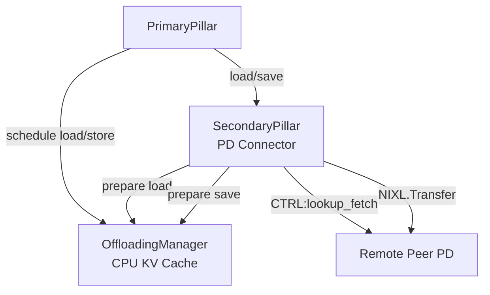

# PD Connector Design Document

## Abstract

In this design PD disaggregation is based on the vLLM CPU KV cache which is per vLLM instance and it is in canonical layout (single TP unified block size). The PD Connector is a secondary pillar that is registered as such. Orchestration with the CPU cache is done via the PrimaryPillar and it not known to the secondar pillars.

## Assumptions

- Decoder can be known or unknown to Prefiller when a request is submitted to the Prefiller (Deffered decode)
- A request can be submitted to the Decoder before Prefiller has completed the request
- Translating canonical layout to per GPU worker layout is done in the worker context (Secondary pillars are agnostic to that)
- A store operation to the CPU KV cache can fail only by:
  - Allocation failure
  - Prefiller crash

## Requirements

- Each Prefill node can service pull requests from any other node in the cluster
- Crash of Prefiller or Decoder should be handled gracefully without any resource leaks
- Support general P2P sharing pro-active and reactive
- Security? Does Prefiller or Decoder should accept transfer requests without any authentication?
- Different block size across nodes in the cluster?
- Performance of TTFT and Tok/Sec should be similar to the existing NixlConnector

## HLD

### Architecture

#### Components

- **PrimaryPillar** — The main component that drives the KV cache lifecycle. It interacts with the OffloadingManager to offload GPU memory to CPU and triggers secondary pillars accordingly.

- **SecondaryPillar** — A pluggable component registered with the OffloadingManager that implements the actual KV cache transfer between nodes. The PD Connector is implemented as a secondary pillar, handling load and store between peers.

#### Component Diagram



### Design Decisions

- P block IDs – how do we pass request's allocated blocks on Prefiller to Decoder.
  - **Option 1** - Add allocated blocks to request header on Prefiller.
    - When do we know for sure that blocks have been saved already
  - **Option 2** - Control message that will prepare the data operation and then trigger one-sided transfer.
- Allow streaming of saved KV blocks on the prefiller side to the Decoder.
### API

#### Secondary Pillar
- `register_secondary_pilar()`
- `load(job_id, block_hashs, peer_id)` — Decoder initiates a load from Prefiller
- `get_required_blocks()` - Polled by the primary pillar
- `save(job_id, block_descs)` — Prefiller saves blocks
- `get_finished()` — Async notification of load/save operation completion

### Flow

#### Sequence Diagram


### Error Handling
#### Allocation Failure on Prefiller Side (valid only when a request is sent to the Decoder before the Prefiller completes it)
TBD
#### vLLM Crash
- A lost control connection between the Prefiller and the Decoder should trigger an abort of all ongoing requests.
#### Submit lookup_fetch() before a request is submitted to the Prefiller
- Timeout TBD

## Implementation

### Step 1: SecondaryPillars

Introduce a `SecondaryPillar` base class and a `SecondaryPillars` registry component. `PrimaryPillar` depends on `SecondaryPillars` to dispatch operations. Individual `SecondaryPillar` implementations register themselves into `SecondaryPillars` without any knowledge of `PrimaryPillar`.

```
PrimaryPillar --> SecondaryPillars --> [SecondaryPillar, SecondaryPillar, ...]
```

#### Tasks
- [ ] Define `SecondaryPillar` abstract base class with `load`, `save`, `get_finished` methods
- [ ] Implement `SecondaryPillars` registry with `register(pillar: SecondaryPillar)` and dispatch methods
- [ ] `PrimaryPillar` holds a reference to `SecondaryPillars` and calls it on `load`/`save`
- [ ] `SecondaryPillars` iterates registered pillars and calls each in sequence
- [ ] Add unit tests for registration and sequential dispatch

#### Tests

Tests are located in `tests/test_secondary_pillars.py`.

To run:
```bash
cd /home/lirans/my-utils/pd-connector
python3 -m pytest tests/test_secondary_pillars.py -v
```

### Step 2: PDConnector as a SecondaryPillar

Implement `PDConnector` as a concrete `SecondaryPillar`. It handles the actual KV cache transfer between Prefiller and Decoder nodes using NIXL.

On the **Prefiller side**, `save()` stores KV block descriptors and waits for incoming `lookup_fetch` requests from the Decoder.
On the **Decoder side**, `load()` connects to the Prefiller peer, sends a `lookup_fetch` control message, and triggers a NIXL transfer to save the blocks into the local CPU cache.

#### Tasks
- [ ] Implement `PDConnector(SecondaryPillar)` class in `src/pd_connector.py`
- [ ] `save(job_id, block_descs)` — register block descriptors, ready to serve `lookup_fetch`
- [ ] `load(job_id, block_hashes, peer_id)` — connect to peer, send `CTRL:lookup_fetch`, trigger NIXL transfer
- [ ] `get_finished(job_ids)` — poll NIXL transfer status and return completed job ids
- [ ] Add unit tests in `tests/test_pd_connector.py`

#### Tests

Tests are located in `tests/test_pd_connector.py`.

To run:
```bash
cd /home/lirans/my-utils/pd-connector
python3 -m pytest tests/test_pd_connector.py -v
```

### Step 3: ZMQ CtrlTransport

Implement `ZmqCtrlTransport` — a concrete `CtrlTransport` backed by ZMQ. The listener uses a ZMQ `ROUTER` socket so it can accept connections from multiple peers simultaneously. Each peer connects with a `DEALER` socket, and the router identifies peers by their socket identity.

Peer liveness is tracked via a heartbeat mechanism. If a peer stops sending heartbeats within the timeout window, the transport fires a `on_peer_down(peer_id)` callback so that `PDConnector` can abort all in-progress jobs for that peer.

```
Peer A (DEALER) ──┐
Peer B (DEALER) ──┼──► ZmqCtrlTransport (ROUTER) ──► PDConnector
Peer C (DEALER) ──┘         │
                        heartbeat monitor
                        → on_peer_down(peer_id)
```

#### Design decisions
- **Socket types**: `ROUTER` on the listener side, `DEALER` on the connecting side — allows multiplexing N peers on one port.
- **Heartbeat**: each peer sends a periodic `{"type": "heartbeat", "peer_id": "..."}` message. The listener tracks `last_seen[peer_id]` and fires `on_peer_down` if a peer exceeds `heartbeat_timeout_s`.
- **Message format**: MessagePack (msgspec) — consistent with the existing NIXL handshake wire format.
- **Graceful disconnect**: a `{"type": "disconnect", "peer_id": "..."}` message triggers immediate `on_peer_down` without waiting for timeout.

#### Tasks
- [ ] Implement `ZmqCtrlTransport(CtrlTransport)` in `src/zmq_ctrl_transport.py`
- [ ] Listener thread: ZMQ `ROUTER` socket, receives from any peer, dispatches to `recv()` queue
- [ ] Sender: ZMQ `DEALER` socket per peer (lazily created), sends messages to a specific peer
- [ ] Heartbeat sender: background thread sends heartbeat to each connected peer at `heartbeat_interval_s`
- [ ] Heartbeat monitor: background thread checks `last_seen` and calls `on_peer_down(peer_id)` on timeout
- [ ] Register `on_peer_down` callback in `PDConnector` to cancel in-progress jobs for the failed peer
- [ ] Add unit tests in `tests/test_zmq_ctrl_transport.py`

#### Tests

Tests are located in `tests/test_zmq_ctrl_transport.py`.

To run:
```bash
cd /home/lirans/my-utils/pd-connector
python3 -m pytest tests/test_zmq_ctrl_transport.py -v
```

### Step 4: NIXL Transfer

Replace the `NixlTransport` abstraction with a direct `nixl_agent` implementation inside `PDConnector`. No wrapper class — NIXL calls are made inline.

#### NIXL API mapping

| PDConnector action | NIXL call |
|---|---|
| Startup | `nixl_agent(peer_id, nixl_agent_config())` |
| `save()` | `agent.register_memory(block_descs, mem_type="DRAM")` |
| `connect()` | exchange `agent_metadata` over ZMQ ctrl channel → `agent.add_remote_agent(remote_metadata)` |
| `_handle_lookup_fetch()` | `agent.get_xfer_descs(local_descs)` + `agent.initialize_xfer("WRITE", ...)` + `agent.transfer(handle)` |
| `get_finished()` | `agent.check_xfer_state(handle)` == `"DONE"` for each active handle |
| `save()` complete | `agent.deregister_memory(reg_list)` |

#### Metadata exchange

NIXL requires both peers to have each other's agent metadata before a transfer can start. The metadata is exchanged over the existing ZMQ ctrl channel using a new message type:

```
Decoder → Prefiller:  {"type": "agent_metadata", "peer_id": "...", "metadata": <bytes>}
Prefiller → Decoder:  {"type": "agent_metadata", "peer_id": "...", "metadata": <bytes>}
```

`PDConnector.connect()` sends local metadata immediately after the ZMQ connection is established. The listener thread handles incoming `agent_metadata` messages by calling `agent.add_remote_agent()`.

#### Tasks
- [ ] Create `nixl_agent` in `PDConnector.__init__()` with UCX backend
- [ ] In `save()`, register block memory with NIXL and store `nixlRegDList` per job
- [ ] In `connect()`, send local `agent_metadata` over ZMQ ctrl channel
- [ ] In `_listen()`, handle `agent_metadata` message → call `agent.add_remote_agent()`
- [ ] In `_handle_lookup_fetch()`, call `initialize_xfer("WRITE", ...)` + `transfer()`, store handle keyed by transfer_id
- [ ] In `get_finished()`, call `check_xfer_state()` per active handle; on `"DONE"` release handle and deregister memory
- [ ] Add integration test with two real PDConnector instances and CPU DRAM buffers
