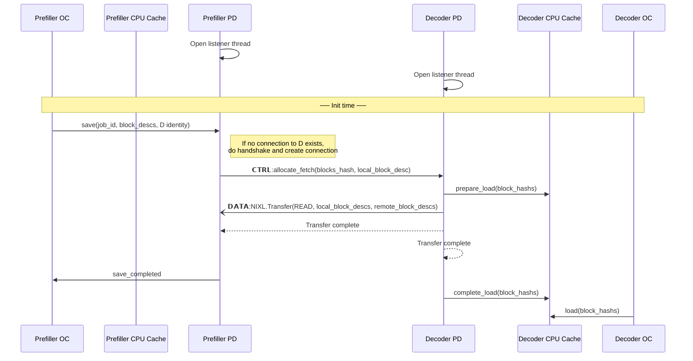
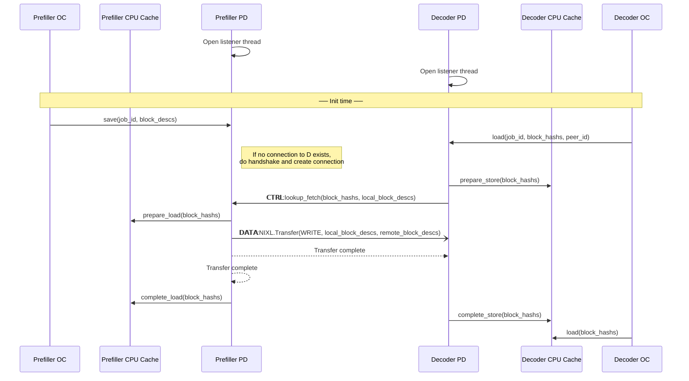

# PD Connector Design Document

## Abstract

In this design PD disaggregation is based on the vLLM CPU KV cache which is per vLLM instance and it is in canonical layout (single TP unified block size). The PD Connector is a secondary pillar that is registered as such. The OffloadingManager exposes an API to the secondary pillar to allow load, store and abort operations to the CPU KV cache.

## Assumptions

- Decoder can be known or unknown to Prefiller when a request is submitted to the Prefiller
- A request can be submitted to the Decoder before Prefiller has completed the request
- Translating canonical layout to per GPU worker layout is done in the worker connector context (Secondary pillars are agnostic to that)
- A store operation to the CPU KV cache can be failed only by:
  - Allocation failure
  - Prefiller crash

## Requirements

- Each Prefill node can service pull requests from any other node in the cluster
- Crash of Prefiller or Decoder should be handled gracefully without any resource leaks
- Support general P2P sharing pro-active and reactive
- Security? Does Prefiller or Decoder should accept transfer requests without any authentication?
- Different block size across nodes in the cluster?
- Performance of TTFT and Tok/Sec should be similar to the existing NixlConnector

## HLD

### Design Decisions

- P block IDs – how do we pass request's allocated blocks on Prefiller to Decoder
  - **Option 1** - Add allocated blocks to request header on Prefiller
    - When do we know for sure that blocks have been saved already
  - **Option 2** - Control message from D to Prefiller to lookup and pin the blocks (also transfer is possible here): `LookupAndTransfer(blocks_hash, len, Decoder_allocated_blocks_ids)`
    - How do we index these blocks

### API
#### Secondary pillar
- `register_secondary_pilar()`
- `load(job_id, block_hashs, peer_id)` — Decoder initiates a load from Prefiller
- `save(job_id, block_descs)` — Prefiller saves blocks
- `get_finished()` — Async notification of load/save operation completion
- `abort(job_id)` — Abort an in-progress operation

### Flow

#### Sequence Diagram – Push

#### Sequence Diagram – Pull

