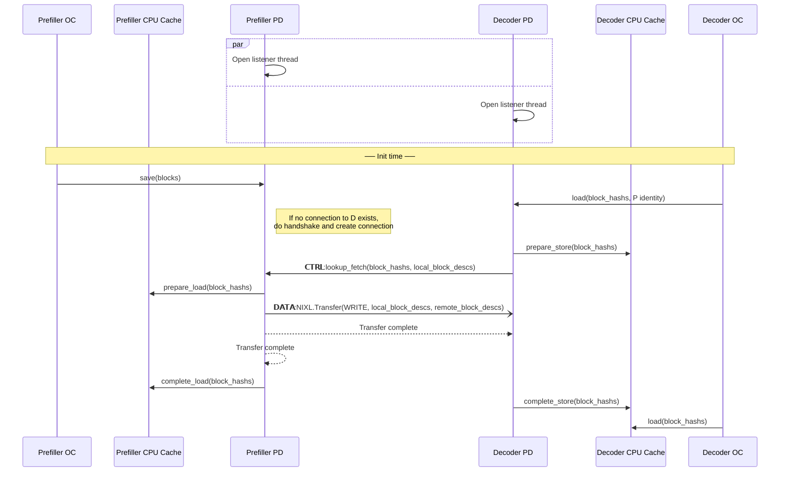

# Prefill-Decode Disaggregation (Pull)

```mermaid
sequenceDiagram
    participant Prefiller_OC as Prefiller OC
    participant Prefiller_CPU_Cache as Prefiller CPU Cache
    participant Prefiller_PD as Prefiller PD
    participant Decoder_PD as Decoder PD
    participant Decoder_CPU_Cache as Decoder CPU Cache
    participant Decoder_OC as Decoder OC

    par
        Prefiller_PD->>Prefiller_PD: Open listener thread
    and
        Decoder_PD->>Decoder_PD: Open listener thread
    end

    Note over Prefiller_OC,Decoder_OC: ── Init time ──

    Prefiller_OC->>Prefiller_PD: save(blocks)

    Decoder_OC->>Decoder_PD: load(block_hashs, P identity)
        Note right of Prefiller_PD: If no connection to D exists,<br/>do handshake and create connection

    Decoder_PD->>Decoder_CPU_Cache: prepare_store(block_hashs)

    Decoder_PD->>Prefiller_PD: 𝗖𝗧𝗥𝗟:lookup_fetch(block_hashs, local_block_descs)

    Prefiller_PD->>Prefiller_CPU_Cache: prepare_load(block_hashs)

    Prefiller_PD-)Decoder_PD: 𝗗𝗔𝗧𝗔:NIXL.Transfer(WRITE, local_block_descs, remote_block_descs)

    Prefiller_PD-->>Decoder_PD: Transfer complete
    Prefiller_PD-->>Prefiller_PD: Transfer complete
    Prefiller_PD->>Prefiller_CPU_Cache: complete_load(block_hashs)
    Decoder_PD->>Decoder_CPU_Cache: complete_store(block_hashs)

    Decoder_OC->>Decoder_CPU_Cache: load(block_hashs)
```
