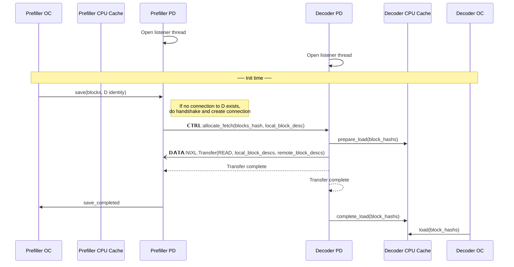

# Prefill-Decode Disaggregation

```mermaid
sequenceDiagram
    participant Prefiller_OC as Prefiller OC
    participant Prefiller_CPU_Cache as Prefiller CPU Cache
    participant Prefiller_PD as Prefiller PD
    participant Decoder_PD as Decoder PD
    participant Decoder_CPU_Cache as Decoder CPU Cache
    participant Decoder_OC as Decoder OC

    Prefiller_PD->>Prefiller_PD: Open listener thread
    Decoder_PD->>Decoder_PD: Open listener thread

    Note over Prefiller_OC,Decoder_OC: ── Init time ──

    Prefiller_OC->>Prefiller_PD: save(blocks, D identity)
    Note right of Prefiller_PD: If no connection to D exists,<br/>do handshake and create connection
    Prefiller_PD->>Decoder_PD: 𝗖𝗧𝗥𝗟:allocate_fetch(blocks_hash, local_block_desc)
    Decoder_PD->>Decoder_CPU_Cache: prepare_load(block_hashs)
    Decoder_PD-)Prefiller_PD: 𝗗𝗔𝗧𝗔:NIXL.Transfer(READ, local_block_descs, remote_block_descs)
    Decoder_PD-->>Prefiller_PD: Transfer complete
    Decoder_PD-->>Decoder_PD: Transfer complete
    Prefiller_PD->>Prefiller_OC: save_completed
    Decoder_PD->>Decoder_CPU_Cache: complete_load(block_hashs)
    Decoder_OC->>Decoder_CPU_Cache: load(block_hashs)
```
