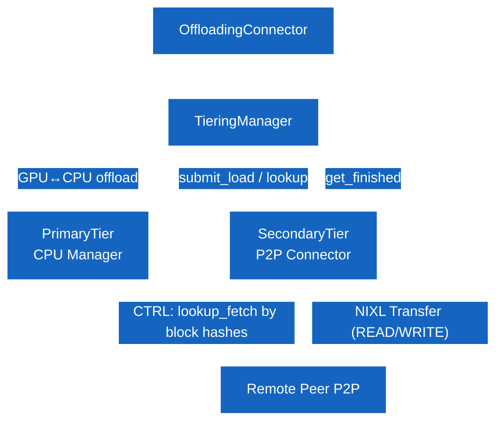
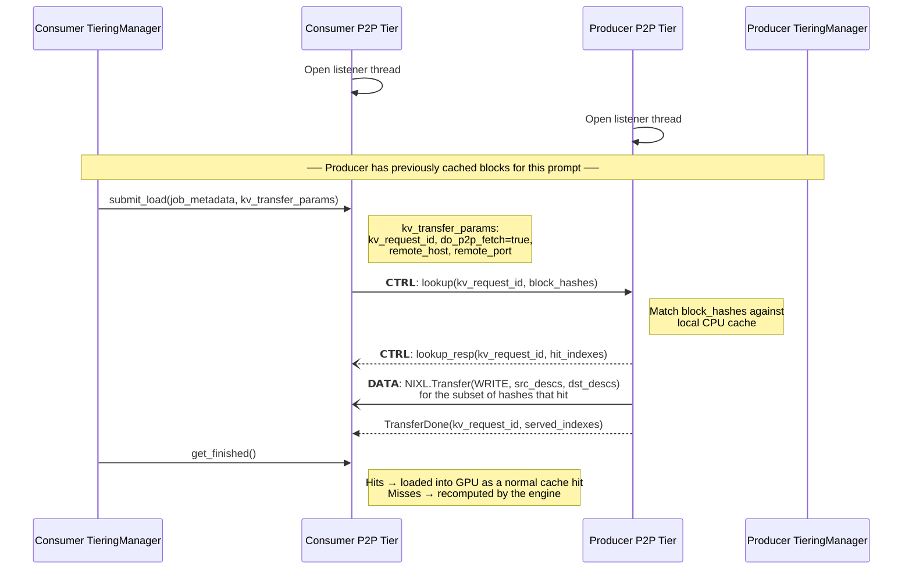

# P2P Connector — Feature Design

The P2P Connector generalizes the [PD Connector](PD-issue.md) into a fully symmetric peer-to-peer mode. It reuses the same secondary-tier architecture (CPU KV cache in canonical layout, NIXL data path, ZMQ control path, unified bi-directional `P2PSession`) but drops the Prefiller / Decoder role distinction.

Every vLLM instance is a **peer**. For any given request, a peer plays one of two roles:

- **Consumer** (a.k.a. client): pulls KV blocks for the request from a remote peer's CPU cache instead of computing them locally.
- **Producer** (a.k.a. server): serves KV blocks from its CPU cache when a remote consumer asks for them.

A single peer can act as consumer for some requests and producer for others at the same time over the same session.

The orchestration layer indicates P2P **on the consumer side only**, on the request itself. The producer is **implicit**: it has no per-request flag; it serves whatever block hashes it currently holds in CPU cache.


## Component Diagram




## Sequence Diagram



## Orchestration-Level Protocol

`kv_transfer_params` is set on the consumer's request only. The producer requires no orchestration signal beyond having offloading enabled and having previously processed work that left the relevant blocks in its CPU KV cache.

### Consumer

Set on every request whose KV blocks should be pulled from a remote peer.

| Field | Type | Required | Description |
|---|---|---|---|
| `kv_request_id` | `str` | Yes | Unique ID for this transfer transaction (allocated by the orchestrator) |
| `do_p2p_fetch` | `bool` | Yes | Indicates that KV blocks should be pulled from a remote peer |
| `remote_host` | `str` | Yes | IP address / hostname of the producer peer |
| `remote_port` | `int` or `str` | Yes | Listening port of the producer peer |


## Minimal Example

```python
# Consumer request — pull KV for this prompt from a peer that has it cached.
kv_transfer_params = {
    "kv_request_id": "<unique-transfer-id>",
    "do_p2p_fetch": True,
    "remote_host": "<producer-ip>",
    "remote_port": <producer-port>,
}

# Producer request — no kv_transfer_params needed.
# The peer simply needs offloading enabled and the relevant blocks already
# resident in its CPU cache (e.g., from a previous request the orchestrator
# routed there).
```
